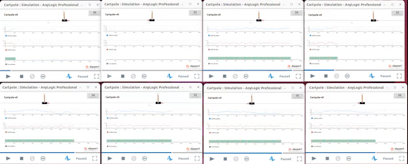
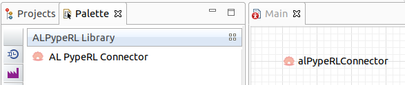
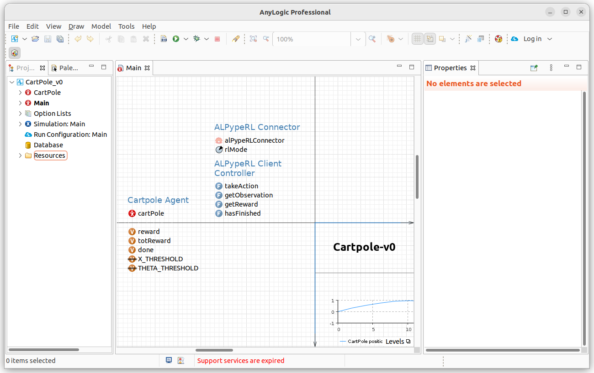

[](https://github.com/psf/black)

# ALPypeRL

**ALPypeRL** or _AnyLogic Python Pipe for Reinforcement Learning_ is an open source library for connecting **AnyLogic** simulation models with **reinforcement learning** frameworks that are compatible with _OpenAI Gymnasium_ interface (single agent).



With **ALPypeRL** you will be able to:

* Connect your AnyLogic model to a reinforcement learning framework of your choise (e.g. ray ``rllib``).
* Scale your training by launching many AnyLogic models simultaneously (*requires an exported model*).
* Deploy and evaluate your trained policy from AnyLogic.
* Debug your AnyLogic models during training (*this is a special feature unique to ALPypeRL that improves the user experience during model debugging remarkably*).
* Leverage on the AnyLogic rich visualization while training or evaluating (*which ties to the previous bullet point*).

There is a more comprehensive [documentation](https://alpyperl.readthedocs.io/en/latest/) available that includes numerous examples to help you understand the basic functionalities in greater detail.

_NOTE: ALPypeRL has been developed using **ray rllib** as the base RL framework. Ray rllib is an industry leading open source package for Reinforcement Learning. Because of that, ALPypeRL has certain dependencies to it (e.g. trained policy deployment and evaluation)._

## Environments

ALPypeRL includes 2 environments that make the connection between _AnyLogic_ and your _python script_ possible:

* [ALPypeRLConnector](https://alpyperl.readthedocs.io/en/latest/AnyLogicConnector.html) - The AnyLogic connector ('agent') library to be dropped into your simulation model.
* [alpyperl](https://alpyperl.readthedocs.io/en/latest/CartPoleV0.html) - The library that you will use after configuring your _policy_ in your _python script_ to connect to the _AnyLogic_ model (includes functionalities to **train** and **evaluate**). 

## Installation

To install the base **ALPypeRL** library in python, use `pip install alpyperl`.

To use **ALPypeRLConnector** in _AnyLogic_, you can add the [library](https://github.com/MarcEscandell/ALPypeRL/tree/main/bin) to your _Palette_. That will allow you to drag and drop the connector into your model. _Note that further [instructions](https://github.com/MarcEscandell/ALPypeRL/wiki/AnyLogicConnector) are required to be followed in order for the connector to work_.



## Requirements

* The **ALPypeRL** requires you to have the **AnyLogic software** (or a valid exported model). AnyLogic is a licensed software for building simulations that includes an ample variety of libraries for modelling many industry challenges. At the moment, AnyLogic provides a *free* license under the name PLE (Personal Learning Edition). There are other options available. For more information, you can visit the [AnyLogic website](https://www.anylogic.com/).

_Note: This is not a package that is currently backed by the AnyLogic support team._

* The python package `alpyperl` requires (among others) 4 packages that are relatively heavy (and might take longer times to install depending on the host machine specs):

    * ``ray``
    * ``ray[rllib]``
    * ``tensorflow``
    * ``torch``

## API basics

### Training

To be able to train your policy, you must have the following:

* An **AnyLogic model** that requires decisions to be taken as the simulation runs. Using the [CartPole-v0](https://alpyperl.readthedocs.io/en/latest/CartPoleV0.html) example, a decision must be taken on the direction of the force to be applied so the pole can be kept straight for as long as possible. For that, the AnyLogic model will be making requests to the **ALPypeRLConnector** and consuming the returned/suggested action.



* A **python script** that contains the RL framework. Here is where the policy is going to be trained. For that, you will need to create your _custom environment_ taking into consideration what your AnyLogic model expects to return and receive. By default, you must define the _action_ and _observation_ spaces. Please visit the [CartPole-v0](https://alpyperl.readthedocs.io/en/latest/CartPoleV0.html) example for a more detailed explanation.

```python
from alpyperl.examples.cartpole_v0 import CartPoleEnv
from ray.rllib.algorithms.ppo import PPOConfig


policy = (
    PPOConfig()
    .rollouts(
        num_rollout_workers=2,
        num_envs_per_worker=2,
        ignore_worker_failures=True,
        recreate_failed_workers=True,
        num_consecutive_worker_failures_tolerance=3
    )
    .environment(
        CartPoleEnv, 
        env_config={
            'run_exported_model': True,
            'exported_model_loc': './resources/exported_models/cartpole_v0',
            'show_terminals': False,
            'verbose': False
        }
    )
    .build()
)

for _ in range(10):
    result = policy.train()

checkpoint_dir = policy.save("./resources/trained_policies/cartpole_v0")
print(f"Checkpoint saved in directory '{checkpoint_dir}'")

# Close all enviornments
policy.stop()
```

### Evaluation

The evaluation of your _trained policy_ is made simple in **alpyperl**. See the example:

```python
from alpyperl.serve.rllib import launch_policy_server
from alpyperl.examples.cartpole_v0 import CartPoleEnv
from ray.rllib.algorithms.ppo import PPOConfig


launch_policy_server(
    policy_config=PPOConfig(),
    env=CartPoleEnv,
    trained_policy_loc='./resources/trained_policies/cartpole_v0/checkpoint_000010',
    port=3000
)
```

Once the server is on, you can run your AnyLogic model and test your trained policy. You are expected to select mode _EVALUATE_ and specify the server _url_.

## Bugs and/or development roadmap

At the moment, ALPypeRL is at its earliest stage. You can join the [alpyperl project](https://github.com/MarcEscandell/ALPypeRL/discussions) and raise bugs, feature requests or submit code enhancements via pull request.

## Support ALPypeRL's development

If you are financially able to do so and would like to support the development of **ALPypeRL**, please reach out to marcescandellmari@gmail.com.

## License

The ALPypeRL software suite is licensed under the terms of the Apache License 2.0. See [LICENSE](https://github.com/MarcEscandell/ALPypeRL/blob/main/LICENSE) for more information.

