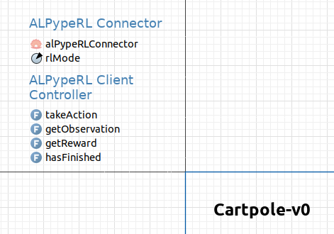

######################
The AnyLogic Connector
######################

This page will guide you through the process of setting up your **connection** from the **AnyLogic side**. To help make the explanation more clear, we will be using the :ref:`CartPole-v0 example<How to train your first policy. The CartPole-v0 example.>`.

.. note::
    You may find the source code of the *CartPole-v0* `here <https://github.com/MarcEscandell/ALPypeRL/tree/main/alpyperl/examples/cartpole_v0/CartPole_v0>`__.

The summary of steps required to follow are:

1. Add **ALPypeRL Connector Library** to your *AnyLogic Palette*.
2. Drag and drop an instance of **ALPypeConnector** to your **root** (also defaulted as ``Main`` the first time you create a model).
3. Add ``ALPypeRLClientController`` interface to the list of interfaces in your **root** agent and **implement** the required functions.
4. Call ``requestAction`` when the RL agent in the simulation requires a new action (or a new instruction) to continue with the run.

**************************************************************
Add ``ALPypeRLConnector`` library to your **AnyLogic Palette**
**************************************************************

To begin, you must add the **ALPypeRL Connector Library** to your AnyLogic *Palette*. If you are not familiar with AnyLogic, this step is quite straightforward. You simply need to locate the green cross at the end of the *Palette* screen (the location of the *Palette* may vary based on your AnyLogic view arrangement, but it is usually presented on the left-hand side together with the *Projects* structure).

Once you have located the green cross, click on it and select *Manage Libraries…*. Then, click on the *Add* button and select the :download:`ALPypeLibrary.jar <../bin/anylogic-8.8/ALPypeLibrary.jar>` file. Note that this is a link to download a library that was generated and is **only compatible with AnyLogic 8.8.x**. There is also a link :download:`ALPypeLibrary.jar <../bin/anylogic-8.7/ALPypeLibrary.jar>`  to the library **compatible with AnyLogic 8.7.x**.

.. image:: images/add_new_library_anylogic_window.png
    :alt: Add new library to AnyLogic Window

You should now be able to see the newely added library in your list of available libraries at the *Palette*.

***************************************************
Drag and drop an instance of ``ALPypeRLConnector``
***************************************************

Now that you have access to the **ALPypeRL Connector** from *AnyLogic*, you can proceed by dragging and dropping an instance of it into your model.

.. warning::
    Please note that when creating a *custom library* in *AnyLogic*, the **additional required dependencies** are not included in the package by default. While that remains a problem, you will need to **include them manually**. 

    You can download them `here <https://github.com/MarcEscandell/ALPypeRL/tree/main/bin/lib>`__.
    
    Just click your project on the *Projects* tab and go to *Properties*. There you can add other dependencies manually at *Jar files and class folders required to build the model* as shown in the image:

    .. image:: images/alpyperl_dependencies.png
        :alt: ALPypeRL jar dependencies

It's important to note that you should place the connector in your **root** agent. If you're not familiar with *AnyLogic*, the root agent is the one that usually holds and compiles the other objects in your simulation (it's like the *home* for everything else). 

.. tip:: 
    Another reference you can use to identify the *root* agent, it's the one that you select when you set up your ``Simulation`` experiment as the *Top-level agent*. See the image below:
    
    .. image:: images/root_agent.png
        :alt: AnyLogic root agent

**************************************
Implement ``ALPypeRLClientController``
**************************************

This is a very important step in order for the *ALPypeRL Connector* to understand what it needs to do when the training starts or when you are evaluating your policy.

First, you must add ``ALPypeRLClientConnector`` to the list of interfaces of your **root** agent. To do this, first click on a random point in the canvas of your *root* agent (usually named as ``Main``) and then navigate to the *Properties* page. Scroll down to find the section *Advanced Java*. You should be able to see *Implements (comma-separated list of interfaces)*. Then you can add ``ALPypeRLClientController``.

.. image:: images/root_interface.png
    :alt: Root interface

Next, if you try to compile your model, you will be getting at least 4 new errors as shown in the image:

.. image:: images/interface_errors.png
    :alt: Interface error

These errors indicate that, if you plan to implement the interface, you must also implement these functions (it's kind of a contract that you have decided to sign).

You can now drag and drop 4 new functions. Their arguments and return types must be as follows (otherwise the compilation error won't go away):

* ``void takeAction(ActionSpace action)``: This function is called by the *RL algorithm* to provide an action to the agent in the environment. Use the ``ActionSpace`` argument to apply the action in your AnyLogic model.

    .. note::
        The **action type must match** what you have (or will define) in your **python script**. Refer to :ref:`Gym Action and Observation spaces <Create the *Action* and *Observation* spaces>`.

* ``double[] getObservation()``: This function returns the current state of the environment as a ``double[]`` array.

* ``double getReward()``: This function returns the reward obtained by the *agent* in the current step.

    .. warning:: 
        Note that this should not be a cumulated value (e.g. in the *CartPole-v0* example, the cart gets a reward of ``1`` for every step that manages to keep the pole straight and within boundaries).

* ``boolean hasFinised()``:  This function returns ``true`` if the simulation has reached a *stop criterion*. (e.g. the pole attached to the cart has exceeded a certain non-recoverable angle or the simulation has reached the end).

*********************************************************************************
Call ``requestAction`` when the RL agent in the simulation requires a new action
*********************************************************************************

.. important::
    In this last step, you simply must **call** ``requestAction()`` **at the location where your agent will need to receive an action** so it can proceed.

The function is accessible from the ``alPypeRLConnector`` instance (e.g. ``alPypeRLConnector.requestAction()``).

In the *CartPole-v0* example, there is a cyclic event that updates the status of the system (*horizontal positon*, *cart speed*, *pole angle* and *pole angular velocity*). At this point in the simulation, the cartpole is requesting the next action, which is either to apply a force to the right or the left.

.. image:: images/event_request_action.png
    :alt: requestAction() function