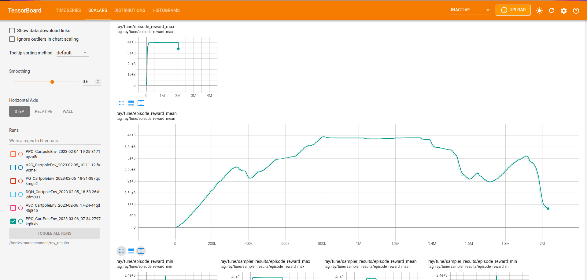

##########################################################
How to train your first policy. The CartPole-v0 example.
##########################################################

.. note:: 
    You may find the source code of the *CartPole-v0* `here <https://github.com/MarcEscandell/ALPypeRL/tree/main/alpyperl/examples/cartpole_v0>`__.

In this page, you will learn how to setup the **python script** where the **RL policy** is going to be **trained**. It's worth noting that while any *RL framework* compatible with `OpenAI Gymnasium <https://gymnasium.farama.org/>`_ can be used, the ALPypeRL has primarily been built around `ray rllib <https://docs.ray.io/en/latest/rllib/index.html>`_ (or only tested on that environment). **rllib**  is an open-source library for reinforcement learning that is constantly evolving and has a large community of users. If you believe *ALPypeRL* should support other *RL packages*, please submit a request.

In summary, in any *RL experiment* that you build using *ALPypeRL*, you should be:

* Creating an **Action and Observation space** custom to your simulation.
* *[Optional]* Wrapping your **simulation environment** within the **BaseAnyLogicEnv**. *Note: This is only aplicable in case the Action and Observation spaces are defined from the python script.*

    .. warning::
        Remember to call ``super(CartPoleEnv, self).__init__(env_config)`` at the end of your ``CustomEnv`` if you inherit ``BaseAnyLogicEnv``.
        
        On the other hand, there's a **FASTER** and **MORE SECURE** way to create a custom environment **by calling** ``create_custom_env(action_space, observation_space)``.

* Configuring your policy and starting your **trainning**.
* Tracking your training progress.

Further details on the actual AnyLogic implementation of the *CartPole-v0* at the end of the page.

**********************************************
Create the *Action* and *Observation* spaces
**********************************************

This step requires the most **customization**, since it is specific to the problem you are trying to solve. Most of the other steps should be applicable to any experiment.

Please check `Spinning up by Open AI <https://spinningup.openai.com/en/latest/spinningup/rl_intro.html>`_ for a more detailed explanation on *action* and *observation* spaces (and in RL In general).

============
Action space
============

The **action space** defines the range of options available to the *RL agent* when deciding what action to take. These options are inherited from **OpenAI Gymnasium**. For more details, please refer to their `documentation <https://gymnasium.farama.org/api/spaces/>`_.

.. note::
    *ALPypeRL* supports most of the **OpenAI Gymnasium** spaces. For more details on the spaces available, please check this `section <How to define a space>`_. Spaces can be created in two ways:

    * Directly from the **ALPypeRLConnector** using the **java** API.
    * From the **python script** using the **gymnasium** package.

For the *CartPole-v0 example* the space has been defined as follows in the **java API** from *AnyLogic*:

    .. code-block:: java

        ActionSpace.init().add(GymSpaces.discrete(2)).build()

.. note::
    Remember to check the box **Create here (else define in python)** in the **ALPypeRLConnector** properties.

    .. image:: images/create_spaces_anylogic.png
        :alt: Create spaces in AnyLogic

=================
Observation space
=================

The **observation space** is the information that the RL policy will receive (what it can *see*) from the simulation. You could think that the more your policy can see (or the more parameters you pass), the more chances the policy has to learn. However, irrelevant observations might extend your training considerably as the policy tries to remove the noise. In the same way, lack of information can result in slow learning or no learning at all.

.. note:: 
    Setting up the right *action* and *observation* spaces in order for your policy to learn as fast and as better as possible is part of the reinforcement learning challenge and it will vary depending on each problem. There is no right or wrong answer. You will need to experiment and find the right balance.

For the *CartPole-v0 example* the observation space has been defined as follows in the **java API** from *AnyLogic*:

    .. code-block:: java

        ObservationSpace.init()
            .add(GymSpaces.box(-2 * 2.4, 2 * 2.4))
            .add(GymSpaces.Box.unbounded())
            .add(GymSpaces.box(-2 * 12 * 2 * PI / 360.0, 2 * 12 * 2 * PI / 360.0))
            .add(GymSpaces.Box.unbounded())
            .build()

*******************************************************************
*[Optional]* Wrap your ``CustomEnv`` around the ``BaseAnyLogicEnv``
*******************************************************************

.. important::
    As mentioned earlier, this step is only required if you are defining your *action* and *observation* spaces from the python script. If you are defining them from the **ALPypeRLConnector**, you can skipt this.

There are two ways to perform this step:

* By **inheriting** ``BasicAnyLogicEnv``.
* By calling ``create_custom_env``.

============================
Inherit ``BasicAnyLogicEnv``
============================

In order for the **rllib** configuration to accept your environment, you must wrap it around the ``BaseAnyLogicEnv`` (in object oriented terms, it requires you to **inherit** this class). This environment contains all the required functions that *rllib* is expecting. At the same time, it will handle the connections directly with your AnyLogic model.

Going back to the *CartPole-v0* example, your *python script* for training shoul look like:

.. code-block:: python

    import math
    from gymnasium import spaces
    import numpy as np
    from alpyperl import BaseAnyLogicEnv

    class CartPoleEnv(BaseAnyLogicEnv):

        def __init__(self, env_config=None):

            # Positional thresholds
            theta_threshold_radians = 12 * 2 * math.pi / 360.0
            x_threshold = 2.4
            # Create observation space array thresholds
            high = np.array(
                [
                    x_threshold * 2,            # Horizontal position
                    np.finfo(np.float32).max,   # Linear speed
                    theta_threshold_radians * 2,# Pole angle
                    np.finfo(np.float32).max    # Angular velocity
                ]
            )
            # Create Action and Observation spaces using `gymnasium.spaces`
            self.action_space = spaces.Discrete(2)
            self.observation_space = spaces.Box(-high, high, dtype=np.float32)
            
            # IMPORTANT: Initialise AnyLogic environment experiment after
            # environment creation
            super(CartPoleEnv, self).__init__(env_config)

As you can see, we have created a simple action space with 2 values as ``spaces.Discrete(2)`` which can take either ``0`` or ``1``. Later in the simulation, you will be in charge of translating these indices into specifict actions. 

On the other hand, we have created an array (size 4) for the observations using the ``spaces.Box(low, high)``. The content of the array is expected to be: *cartpole position*, *linear velocity*, *pole angle* against vertical and *angular velocity*.

When creating a **Box space**, you will be asked to provide the *minimum* and *maximum* values. For this particular problem, the minimum and maximum ranges for the observation space are limited to the cartPole x position and the angle of the pole. The horizontal position represents the limits set in the AnyLogic model (if the car goes beyond the screen) or the cartpole reaches a certain angle that is considered non-recoverable. The other parameters are unbounded.

.. warning::
    **Another very important step is to call** ``super(CartPoleEnv, self).__init__(env_config)`` **at the end of your configuration**. This step will execute the initialization code defined in the parent class ``BaseAnyLogicEnv``.

==========================
Call ``create_custom_env``
==========================

As mentioned earlier in the summary, there's a faster way to create a custom environment that will ensure that some of the required steps that you must follow if you inherit ``BaseAnyLogicEnv`` are not missed. And this is by using the function ``create_custom_env(action_space, observation_space)``. For this particular case, you just need to pass a valid *action* and *observation* spaces. The function will return a **custom class definition** which includes your spaces.

*******************************************
Policy configuration and training execution
*******************************************

Once your environment has been properly defined, either directly from AnyLogic or by wrapping your *CustomEnv* around the ``BaseAnyLogicEnv`` you are good to continue setting up the policy that you choose to train (e.g. ``PPO``) and start the training process.

There are plenty of `policies available <https://docs.ray.io/en/latest/rllib/rllib-algorithms.html>`_ under the **rllib** package. All of them have their own characteristics and configurable parameters which you'll learn to use. Some settings are common accross algorithms.

In this example we will be using the **PPO** or **Proximal Policy Optimization** algorithm. You can find more details `here <https://docs.ray.io/en/latest/rllib/rllib-algorithms.html#ppo>`__.

Here's an example of training script assuming that you have configured your *action* and *observation* spaces from AnyLogic. In this case, you are only required to pass **AnyLogicEnv** as the environment to the policy (and nothing more). In case you defined your *CustomEnv* in python, then you should pass it as your environment (e.g., *CartPoleEnv* which inherits *BaseAnyLogicEnv*):

.. code-block:: python

    from alpyperl import AnyLogicEnv
    from ray.rllib.algorithms.ppo import PPOConfig

    # Set checkpoint directory.
    checkpoint_dir = "./resources/trained_policies/cartpole_v0"

    # Initialize policy.
    policy = (
        PPOConfig()
        .env_runners(
            num_env_runners=2,
            num_envs_per_env_runner=2
        )
        .fault_tolerance(
            recreate_failed_env_runners=True,
            num_consecutive_env_runner_failures_tolerance=3
        )
        .environment(
            AnyLogicEnv, 
            env_config={
                'run_exported_model': True,
                'exported_model_loc': './resources/exported_models/cartpole_v0',
                'show_terminals': False,
                'verbose': False,
                'checkpoint_dir': checkpoint_dir,
                'env_params': {
                    'cartMass': 1.0,
                    'poleMass': 0.1,
                    'poleLength': 0.5,
                }
            }
        )
        .build()
    )

    # Perform training.
    for _ in range(100):
        result = policy.train()

    # Save policy checkpoint.
    policy.save(checkpoint_dir)
    print(f"Checkpoint saved in directory '{checkpoint_dir}'")

    # Close all enviornments.
    # NOTE: This is required to be called for correct checkpoint saving by ALPypeRL.
    policy.stop()

There are a few important notes to take here:

* If you decide to **scale** your training to multiple **workers** and **environments**, you must be aware that this is only possible if you are in a possession of an AnyLogic license. That will allow you to export the model into standalone executable. Once you do so, you can proceed to increase the ``num_rollout_workers`` and ``num_envs_per_worker`` to more than 1 (check this `link <https://docs.ray.io/en/latest/rllib/core-concepts.html>`_ for further details and options). You will also need to set some environment variables via ``env_config``. The ``run_exported_model`` controls whether you want to run an exported model or directly from AnyLogic. The ``exported_model_loc`` specifies the location of the exported model folder (it will default to ``./exported_model``).

* If you are unable to export your model or you are currently debugging it and running it directly from AnyLogic, you should default ``num_rollout_workers`` and ``num_envs_per_worker`` to ``1`` and set ``run_exported_model`` to ``False``. Then, when you run your train script, you should be getting a message informing you that your python script is ready and waiting for your simulation model to be launched on the AnyLogic side. If the connection is succesful, you will see your model running (as fast as possible). That indicates that the training has started. Note that you define the number of *training steps* in the *for loop* that encapsulates your ``policy.train()``.

* You **must** set a ``checkpoint_dir`` in order to save your policy. This is the directory where your policy will be saved as well as some *ALPypeRL* metadata.

* You can pass **custom simulation parameter** values via ``env_params``. These will be passed to your AnyLogic model when it is launched. In this example, we are passing the cart and pole masses as well as the pole length. The **keys of the dictionary must match the names of the parameters** in your AnyLogic model.

.. note::
    ``'show_terminals'`` is a flag (or ``boolean``) that allows you to activate each simulation model terminal. This specially useful if you want to track individual models while training via log messages. *Remember* that this is only applicable if you are running an exported version.

**************************************************
Track your training progress using ``tensorboard``
**************************************************

**rllib** uses **tensorboard** to display and help you analyse many parameters from your current policy training.

By default, TensorBoard will be saving the training parameters into ``~/ray_results``. If you want to launch the dashboard and visualise them, you can execute:

.. code-block:: console

    tensorboard --logdir=~/ray_results

..  tip::
    Most likely you will be looking to see your policy **mean reward** as the training progresses. Once your TensorBoard has been launched, you can head to 'SCALARS' and apply a filter to display 'reward'-related parameters (as shown in the screenshot).

******************************
The CartPole-v0 implementation
******************************

.. note::
    You may find the source code of the *CartPole-v0* `here <https://github.com/MarcEscandell/ALPypeRL/tree/main/alpyperl/examples/cartpole_v0/CartPole_v0>`__.

In this section, you can have a more detailed look on how the *CartPole-v0* has been implemented in AnyLogic. Before that, though, you should have connected your AnyLogic model correctly using the **ALPypeRLConnector** agent. Click :ref:`here <The AnyLogic Connector>` to review how this is done.

Once setup properly, we can continue implementing the required functions by ``ALPypeRLClientController`` interface:

.. warning::
    **Adding and implementing** ``ALPypeRLClientController`` **is crucial** as it will be used by the ``ALPypeRLConnector`` to drive the simulation.

* ``void takeAction(RLAction action)``. This function takes ``ALPypeRLConnector.RLAction`` as an argument. 

    .. note::
        ``RLAction`` class has been build around the assumption that actions can be:

        * A **single discrete** value (or *integer*) which you can access by calling ``int getIntAction()`` as shown in the *CartPole-v0* example.
        * A **single continuous** value, accessible by calling ``double getDoubleAction()``. Check the :ref:`CartPole-v1 example <How to set continuous actions. The CartPole-v1 example.>`.
        * An **array of numbers**. accessible by calling ``Number[] getActions()`` or ``Number getNumber(int index)``, ``Double getDouble(int index)`` and ``Integer getInt(int index)`` if you want to access specific values given an index. Check the :ref:`CartPole-v2 example <How to set an array of continuous actions. The CarPole-v2 example.>` and :ref:`CartPole-v3 example <How to set an array of mixed actions. The CarPole-v3 example.>`.
        
    .. warning::
        The method that you are calling should be consistent with the **action_space** that you have defined. A quite common mistake is to retrieve an action by an index that does not match the space type. For example, you call ``getDoubleAction`` when you have defined a ``spaces.Discrete(n)``. In case there is a missmatch, an exception will be thrown. Another common mistake is to try to retrieve an index that is out of bounds.
        
    .. note::
        Action space is always flattened. That means that for complex spaces, the order of the accessible indices will be the same as the order of the elements in the array.

  Following is the code used for *CartPole-v0* example in AnyLogic:

      .. code-block:: java

        // Take action and process
        switch (action.getIntAction()) {

            case 0:
                cartPole.applyForce(-1);
                break;
            
            case 1:
                cartPole.applyForce(1);
                break;
        }

        // Check if cartpole has reached max steps
        // or has reached position or angle boundaries
        boolean exeedPhysLim = cartPole.getXPosition() < -X_THRESHOLD 
                            || cartPole.getXPosition() > X_THRESHOLD 
                            || cartPole.getAngle() < -THETA_THRESHOLD 
                            || cartPole.getAngle() > THETA_THRESHOLD;
        boolean exeedTimeLim = time() == getEngine().getStopTime();

        // Compute rewards and check if the simulation is terminal
        if (!exeedPhysLim && !exeedTimeLim) {
            // Set reward
            reward = 1;
        } else {
            // Set reward
            reward = exeedPhysLim ? 0: 1;
            // Finish simulation
            done = true;
        }

* ``Number[] getObservation()``. In *CartPole-v0* example, 4 parameters will be collected and returned in array form:

    * X position.
    * Linear velocity.
    * Pole Angle.
    * Angular velocity.

  The body of the function is pretty straight forward:
  
    .. code-block:: java

        return new Number[] {
            cartPole.getXPosition(),
            cartPole.getLinearVelocity(),
            cartPole.getAngle(),
            cartPole.getAngularVelocity()
        };

* ``double getReward()``. As you saw in the code above, a reward of **1** is collected for every step of the simulation where the cart and the pole are within the boundaries set. In this example, the reward is set during the execution of ``takeAction`` function, but this may not be the case in other problems.

* ``boolean hasFinished()``. Just like ``getReward``, there is a local variable ``done`` that will indicate if the model has exceeded the boundaries set or it has reach the end of the simulation clock. It is also defined during ``takeAction``.

    .. important::
        You **must return** ``true`` **when the simulation has reached the end**. Failing to do so will result in your simulation training geting stuck as exposed :ref:`here <Your AnyLogic model never stops or reaches the end and gets stuck>`.

        You can reuse the following code:

        .. code-block:: java
            
            // [...]
            boolean exeedTimeLim = time() == getEngine().getStopTime();
            
            return exeedTimeLim /*[&& other conditions]*/;
