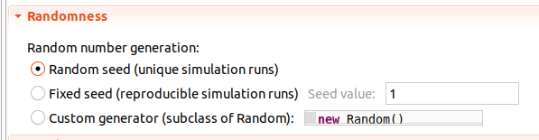
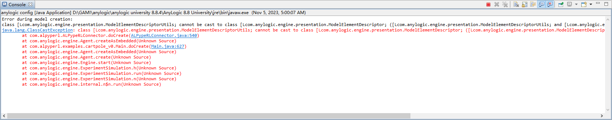

################################################
Most common issues and how to troubleshoot them
################################################

These are some of the most common issues captured by users when seting up or running *ALPypeRL*:

* ``Cannot flatten array`` error.
* Missing ``alpyperl_spaces`` file during evaluation.
* Your AnyLogic model never stops or reaches the end and gets stuck.
* You missed implementing ``ALPypeRLClientController`` required methods.
* Action space missmatch.
* Evaluation server is not running.
* You didn't randomize your AnyLogic simulation model.
* You get a `ClassCastException` when running the example models.

If you face an issue that doesn't appear in this list and are unable to solve it, feel free to raise it `here <https://github.com/users/MarcEscandell/projects/1/views/2>`_ as others might benefit from it. 

*******************************
``Cannot flatten array`` error
*******************************

You will receive the following error when the observation space defined does not match the observation returned by ``getObservation()`` in your AnyLogic model:

.. code-block:: console

	Cannot flatten array because sizes don't match (space: 198, x: 197)
	java.lang.Error: Cannot flatten array because sizes don't match (space: 198, x: 197)
		at com.alpype.RLSpace.flatten(RLSpace.java:158)
		at com.alpype.ALPypeRLConnector.requestAction(ALPypeRLConnector.java:597)
		at carracing.Car.executeActionOf(Car.java:847)
		at com.anylogic.engine.EventTimeout.execute(Unknown Source)
		at com.anylogic.engine.Engine.b(Unknown Source)
		at com.anylogic.engine.Engine.bm(Unknown Source)
		at com.anylogic.engine.Engine.e(Unknown Source)
		at com.anylogic.engine.Engine$i.run(Unknown Source)

This is a very common error that can happen even when your code is in fact correct. During initialization, *ALPypeRL* calls ``reset()``, which at the same time calls ``getObservation()``, so it can get a sample of the observation space to be used to define the neural network size in the python side. During this process, some of your objects might have not yet been created (in case you are using dynamic calls), which results in a different observation space size.

A way to solve such problem, is to hardcode the observation space size in your ``getObservation()`` function. Here's an example that checks for ``time() > 0``. If time is ``0``, it returns a zero array with the right size:

.. code-block:: java

	public Number[] getObservation() {
		// To avoid exception at model initialization
		if (time() > 0) {
			List<Number> observation = new ArrayList<>();
			observation.addAll(car.getVisionReadings());
			observation.add(roundToDecimal(car.getLinearVelocity(), 2));
			observation.add(car.getTrackCompletion());
			return observation.toArray(new Number[observation.size()]);
		}
		// Return empty observation
		int size = (int) Math.sqrt(numSensors);
		Integer[] emptyObs = new Integer[size * size + 2];
		// Initialize all elements to zero
		for (int i = 0; i < emptyObs.length; i++) {
			emptyObs[i] = 0;
		}
		return emptyObs;
	}

***************************************************
Missing ``alpyperl_spaces`` file during evaluation
***************************************************

If when calling your ``launch_policy_server`` you get the following error, you might have not closed your policy and your environments correctly during training:

.. code-block:: console

	FileNotFoundError: [Errno 2] No such file or directory: './trained_policy/alpyperl_spaces/observation_space.pkl'

To fix this issue, you must ensure to call ``policy.stop()`` at the end of your training script:

.. code-block:: python
	:emphasize-lines: 7

	# [...]
	# Save policy checkpoint.
	policy.save(checkpoint_dir)
	print(f"Checkpoint saved in directory '{checkpoint_dir}'")

	# Close all enviornments.
	policy.stop()

*******************************************************************
Your AnyLogic model never stops or reaches the end and gets stuck
*******************************************************************

If your model never stops or it reaches the end of the simulation and nothing happens, it could be due to 2 potetial reasons:

* Your agent (that is being controlled by an RL policy) is not requesting for new actions. That might happen if you have forgotten to call the ``ALPypeRLConnector.requestAction()``. You might want to review how to add and use the ``ALPypeRLConnector`` and pay special attention to :ref:`step 4 <The AnyLogic Connector>`.
* Another reason could be that your function ``hasFinished()`` does not return ``true`` when the simulation reaches the end. If that is the case, you are advised to include the following check in your code:

.. code-block:: java

	// [...]
	boolean exeedTimeLim = time() == getEngine().getStopTime();
	// [...]

****************************************************************
You missed the implementation of ``ALPypeRLClientController``
****************************************************************

You can fail to implement ``ALPypeRLClientController`` in two ways:

* You didn't add ``ALPypeRLClientController`` to the list of interfaces of your ``root`` (``Main``) model. When that happens, the python side or ``alpyperl`` won't be able to control your simulation model in the way that is required. You will be getting the following *class casting exception*:

.. code-block:: console

	java.lang.ClassCastException: class test.Main cannot be cast to class com.alpyperl.ALPypeRLClientController (test.Main and com.alpyperl.ALPypeRLClientController are in unnamed module of loader 'app')
		at com.alpyperl.ALPypeRLConnector.getClientController(ALPypeRLConnector.java:297)
		at com.alpyperl.RLJavaControllerImpl.reset(RLJavaControllerImpl.java:225)
		at java.base/jdk.internal.reflect.NativeMethodAccessorImpl.invoke0(Native Method)
		at java.base/jdk.internal.reflect.NativeMethodAccessorImpl.invoke(NativeMethodAccessorImpl.java:62)
		at java.base/jdk.internal.reflect.DelegatingMethodAccessorImpl.invoke(DelegatingMethodAccessorImpl.java:43)
		at java.base/java.lang.reflect.Method.invoke(Method.java:566)
		at py4j.reflection.MethodInvoker.invoke(MethodInvoker.java:244)
		at py4j.reflection.ReflectionEngine.invoke(ReflectionEngine.java:357)
		at py4j.Gateway.invoke(Gateway.java:282)
		at py4j.commands.AbstractCommand.invokeMethod(AbstractCommand.java:132)
		at py4j.commands.CallCommand.execute(CallCommand.java:79)
		at py4j.ClientServerConnection.waitForCommands(ClientServerConnection.java:182)
		at py4j.ClientServerConnection.run(ClientServerConnection.java:106)
		at java.base/java.lang.Thread.run(Thread.java:834)

  From the _python_ side you will be able to read:

.. code-block:: console

	It seems you haven't implemented 'ALPypeRLClientController'. Go to your 'root' agent (where you should have dropped 'ALPypeRLConnector') and search for 'Advanced Java / Implements (comma-separated list of interfaces)'. Then add 'ALPypeRLClientController' to your list and implement the required functions

* You forgot to implement ``ALPypeClientController`` functions. This is a more visual error, as it will be highlighted during your AnyLogic model compilation. In a way that is good, because it indicates clearly that you are missing something. You'll see something like:

.. code-block:: console
  
	Description: The type Main must implement the inherited abstract method ALPypeRLClientController.hasFinished(). Location: Test/Main - Agent Type

Expect a similar message for ``takeAction(ActionSpace action)``, ``getObservation()`` and ``getReward()``.

For both case, you might want to review how it is done :ref:`here <The AnyLogic Connector>`.

***********************
Action Space missmatch
***********************

If you receive the following error in your AnyLogic terminal:

.. code-block:: console

	Exception during discrete event execution:
	Your RL policy didn't return an integer action
	java.lang.Error: Your RL policy didn't return an integer action
		at com.alpyperl.ActionSpace.getIntAction(ActionSpace.java:111)
		at com.alpyperl.examples.cartpole_v0.Main.takeAction(Main.java:320)
		at com.alpyperl.ALPypeRLConnector.requestAction(ALPypeRLConnector.java:281)
		at com.alpyperl.examples.cartpole_v0.CartPole.executeActionOf(CartPole.java:367)
		at com.anylogic.engine.EventTimeout.execute(Unknown Source)
		at com.anylogic.engine.Engine.b(Unknown Source)
		at com.anylogic.engine.Engine.bm(Unknown Source)
		at com.anylogic.engine.Engine.e(Unknown Source)
		at com.anylogic.engine.Engine$i.run(Unknown Source)

This means that there is a **missmatch** between the expected ``ActionSpace`` and the defined ``self.action_space`` in the python side when you inherited ``BaseAnyLogicEnv``. Remember that dimensions from both sides must match. If you define an action as ``self.action_space=spaces.Discrete(n)``, then you should expect to call ``action.getIntValue()`` and not ``action.getDoubleValue()``. If you fail to do so, you will receive an error.

Check the :ref:`documentation<How to train your first policy. The CartPole-v0 example.>` for more details.

*********************************
Evaluation server is not running
*********************************

If you select the ``EVALUATE`` mode on your AnyLogic simulation model, but you didn't run your *policy server*, you will receive the following error:

.. code-block:: console

	Exception during discrete event execution:
	org.apache.http.conn.HttpHostConnectException: Connect to localhost:3000 [localhost/127.0.0.1] failed: Connection refused (Connection refused)
	Caused by: Connect to localhost:3000 [localhost/127.0.0.1] failed: Connection refused (Connection refused)
	Caused by: Connection refused (Connection refused)
	kong.unirest.UnirestException: org.apache.http.conn.HttpHostConnectException: Connect to localhost:3000 [localhost/127.0.0.1] failed: Connection refused (Connection refused)
		at kong.unirest.DefaultInterceptor.onFail(DefaultInterceptor.java:43)
		at kong.unirest.CompoundInterceptor.lambda$onFail$2(CompoundInterceptor.java:54)
		at java.base/java.util.stream.ReferencePipeline$3$1.accept(ReferencePipeline.java:195)
		at java.base/java.util.Collections$2.tryAdvance(Collections.java:4745)
		at java.base/java.util.stream.ReferencePipeline.forEachWithCancel(ReferencePipeline.java:127)
		at java.base/java.util.stream.AbstractPipeline.copyIntoWithCancel(AbstractPipeline.java:502)
		at java.base/java.util.stream.AbstractPipeline.copyInto(AbstractPipeline.java:488)
		at java.base/java.util.stream.AbstractPipeline.wrapAndCopyInto(AbstractPipeline.java:474)
		at java.base/java.util.stream.FindOps$FindOp.evaluateSequential(FindOps.java:150)
		at java.base/java.util.stream.AbstractPipeline.evaluate(AbstractPipeline.java:234)
		at java.base/java.util.stream.ReferencePipeline.findFirst(ReferencePipeline.java:543)
		at kong.unirest.CompoundInterceptor.onFail(CompoundInterceptor.java:56)
		at kong.unirest.apache.ApacheClient.request(ApacheClient.java:138)
		at kong.unirest.Client.request(Client.java:57)
		at kong.unirest.BaseRequest.request(BaseRequest.java:365)
		at kong.unirest.BaseRequest.asJson(BaseRequest.java:250)
		at com.alpyperl.ALPypeRLConnector.requestAction(ALPypeRLConnector.java:275)
		at com.alpyperl.examples.cartpole_v0.CartPole.executeActionOf(CartPole.java:367)
		at com.anylogic.engine.EventTimeout.execute(Unknown Source)
		at com.anylogic.engine.Engine.b(Unknown Source)
		at com.anylogic.engine.Engine.bm(Unknown Source)
		at com.anylogic.engine.Engine.e(Unknown Source)
		at com.anylogic.engine.Engine$i.run(Unknown Source)

Proceed to launch your policy as indicated :ref:`here <Evaluating your trained policy>`. Remember that you must have trained your policy before you can jump to evaluating it.

Another potential probelm is that you are not pointing to the right **port**. This is quite a common issue if you are running from a **docker container**. When you do so, your IDE (e.g. VSCode) will try to map the container port to the same host port. However, if the host port has the port already in use, it will look for another one that is free. You must then update your ``serverURL`` parameter on your AnyLogic model.

******************************************
You didn't randomize your simulation runs
******************************************

This is a very subtle, but extremelly important **error** that will determine how well your policy learns. In simple words, if you don't randomize your simulation, every iteration will look the same from the eyes of the policy (e.g. every distribution sampling ``uniform()`` will always return the same values in the same order). As a general rule, you don't want your simulation to be **deterministic**, because it is not **realistic**. Instead, you want it to be **stochastic** so your policy can learn to react better and learn more as it experiences many different scenarios.

To fix this problem, head to your ``Simulation`` experiment and, in the *Properties* section, find *Randomness*. You can choose *Random seed (unique simulation runs)* or *Custom generator (Subclass of Random)* if you have your own seed generator. Either of them works. Do not keep *Fix seed (reproducible simulation runs)* unless you are aware of it and use it purposely to debug your model. My personal recomendation is to use a custom generator where you keep track of the seed you use. Then, in case of error, you can back track the source by reproducing the run. 

*******************************************************************
You get a `ClassCastException` when running the **example models**
*******************************************************************

Some people has reported a `CastClassExeption` error when running the example models without any modification made on their side. This is due to a dependency on the AnyLogic version that exported the ``ALPypeLibrary`` and the uploader. To avoid this problem, ``ALPypeLibrary`` has been exported for different AnyLogic versions. Please ensure to use the right one. 

In case you continue facing an exception of this sort, do not hesitate to reach out to `marcescandellmari@gmail.com <mailto:marcescandellmari@gmail.com>`_ to seek for help.

Here's a screenshot of the error:

