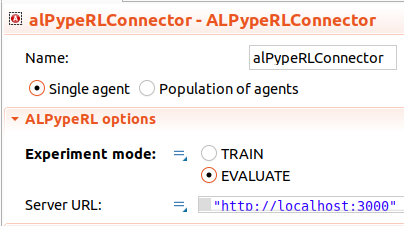

##############################
Evaluating your trained policy
##############################

.. important::
    Evaluating your trained policy is made very simple with ALPypeRL. However, it assumes that you have trained your policy using **rllib** package.

You will be required to:

* Launch your **trained policy server**.
* Change your ``ALPypeRLConnector`` mode to ``EVALUATE`` and specify a ``Server URL``. 

*********************************
Launch your trained policy server
*********************************

The only requirements for this step is to have your trained policy located at a folder:

.. code-block:: python

    from alpyperl.serve.rllib import launch_policy_server
    from alpyperl.examples.cartpole_v0 import CartPoleEnv
    from ray.rllib.algorithms.ppo import PPOConfig

    # Launch server
    launch_policy_server(
        policy_config=PPOConfig(),
        env=CartPoleEnv,
        trained_policy_loc='./resources/trained_policies/cartpole_v0/checkpoint_000010',
        port=3000
    )

It is important to note that when you trained your policy, you defined a location to save your policy (as a checkpoint). You must now point to that folder for ``trained_policy_loc``.

***************************************************
Set your ``ALPypeRLConnector`` mode to ``EVALUATE``
***************************************************

Click on your instance of ``ALPypeRLConnector`` and set the mode to ``EVALUATE``. You will also be required to point to the server url, which is defaulted to ``http://localhost:3000``. The connector will handle the connection as well as sending the observation from the model and processing the action received from the server.

