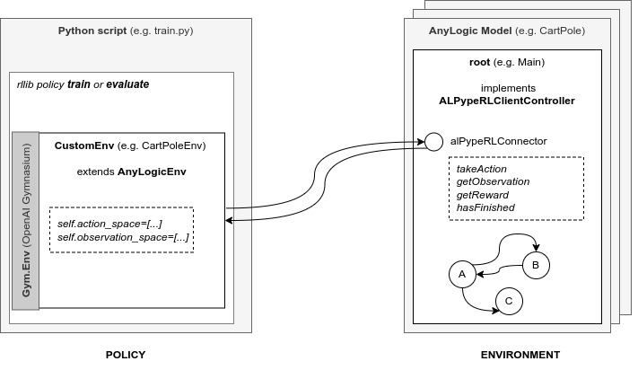

########
ALPypeRL
########

**ALPypeRL** or *AnyLogic Python Pipe for Reinforcement Learning* is an open source library that will allow you to create and run RL experiments using simulations build in the AnyLogic software. With this package, the user can dedicate their time to what it matters: building the right playground (AnyLogic simulation) for the RL policy to learn appropriately.

************
Environments
************

*ALPypeRL* includes 2 environments that make the connection between AnyLogic and your python scrip possible:

* :ref:`ALPypeRLConnector<The AnyLogic Connector>`. The **AnyLogic connector** ('agent') library to be dropped into your simulation model.
* :ref:`alpyperl<How to train your first policy. The CartPole-v0 example.>`. This environment includes functionalities to **train** and **evaluate** *RL policies* in **python**. 

************
Installation
************

* You must add ``ALPypeRLConnector`` in your **AnyLogic Palette**. Download the **jar** file :download:`here<../bin/ALPypeRLLibrary.jar>` and follow the :ref:`instructions<The AnyLogic Connector>`.

    .. image:: images/alpyperl_library.png
        :alt: ALPypeRL Library

    .. warning::
        **The** ``ALPypeRLConnector`` **requires additional configuration steps!** It is not enougth to drag and drop an instance. Please read the :ref:`documentation<The AnyLogic Connector>`.

* To install the base **ALPypeRL** library in python, use:

    .. code-block:: console
        
        pip install alpyperl

************
Requirements
************

* The **ALPypeRL** requires you to have the **AnyLogic software** (or a valid exported model). AnyLogic is a licensed software for building simulations that includes an ample variety of libraries for modelling many industry challenges. At the moment, AnyLogic provides a *free* license under the name PLE (Personal Learning Edition). There are other options available. For more information, you can visit the `AnyLogic website <https://www.anylogic.com/>`_.

.. note::
    This is not a package that is currently backed by the AnyLogic support team.

* The python package ``alpyperl`` requires (among others) 4 packages that are relatively heavy (and might take longer times to install depending on the host machine specs):

    * ``ray``
    * ``ray[rllib]``
    * ``tensorflow``
    * ``torch``

********************
General architecture
********************

The ALPypeRL library consists of 2 artifacts:

* The **ALPypeRL Connector** or **ENVIRONMENT**. If you are familiar with the AnyLogic terms, this object has been basically built from a base ``Agent``. It is in charge of creating a connection from the **java** side.
  
* The python **alpyperl** package or **POLICY**. This library will create the connection from the **python** side. Also, you will find other capabilities such as policy deployment.

Here there's an overall diagram to how ALPypeRL connection is built:

******************************
Reinforcement learning basics
******************************

If you are new to Reinforcement Learning, in this page you'll learn some basics. Although, the best recommendation is to visit the `OpenAI Spinning Up <https://spinningup.openai.com/en/latest/>`_. It's probably the best free **educational** resource at the moment if you want to learn in deep detail how RL works.

As explained in `wikipedia <https://en.wikipedia.org/wiki/Reinforcement_learning>`_:

..

    **Reinforcement learning (RL)** is an area of **machine learning** concerned with how **intelligent agents** ought to **take actions** in an **environment** in order to **maximize** the notion of cumulative **reward**. Reinforcement learning is one of three basic machine learning paradigms, alongside supervised learning and unsupervised learning.

    Reinforcement learning differs from supervised learning in not needing labelled input/output pairs to be presented, and in not needing sub-optimal actions to be explicitly corrected. Instead the focus is on finding a balance between exploration (of uncharted territory) and exploitation (of current knowledge).

.. image:: images/rl_diagram.svg
    :alt: RL diagram from wikipedia
    :align: center

If we want to relate what has been explained to ALPypeRL we can say that:

* The **intelligent agents that take decisions** are the *policies* trained (e.g. using **rllib**). You will need the python package **alpyperl** for dealing with agents. Agent/Policy learning happens in ALPypeRL on the *python* side.
* The **environment** that is used as the *playground* for the policy to learn from via **observation** collection happens on the AnyLogic side. This is all connected thanks to the **ALPypeRLConnector** and the implementation of the required **ALPypeRLClientController** functions. A **reward** will be generated after taking an action. Then, the agent will try to maximize its cumulative value.

Other references:

* `RLlib <https://docs.ray.io/en/master/rllib/core-concepts.html>`_
* `AnyLogic <https://www.anylogic.com/features/artificial-intelligence/>`_

