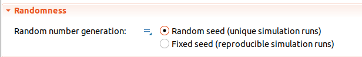

###################################################
Simulation randomness and how to handle failed runs
###################################################

Running reinforcement learning problems requires a large amount of runs. This can really challenge your model. You might assume some situations to be very unlikely (e.g., only happen 1% of the times). However, when you multiply this probability by thousands or milions of runs, you will, for sure, get them. If this rare situations are bugs, replicating them to fix them might be challenging but critical. This is due to lack of control on random number generation happening on the reinforcement learning side.

*ALPypeRL* gives you the posibility to control the randomness of the runs by printing the seed used for each run. Then, you can tell *ALPypeRLConnector* to use that specific seed, replicate the run and debug it. 

In the *ALPypeRLConnector* properties you can see a section for controlling the *Randomness*. There are 2 options:

* **[Default]** *Random seed (unique runs)*: This option will use a random seed for each run. This is the default option. Each run will print the seed used.

* *Fixed seed (reproducible runs)*: This option will use a fixed seed for all the runs. This is useful for debugging purposes. You can replicate a run by using the same seed.

.. important::
    If your model is **stochastic** (e.g., uses **distributions** such as ``uniform()`` or ``normal()``), you **MUST** retrieve the **Randon Number Generator** from the *ALPypeRLConnector* and use it in all your distributions. Otherwise, you will not be able to replicate the runs. For example, the *CartPole* models sets the cartpole position randomly. To make use of the *ALPypeRLConnector* randomness you must rewrite your distributions as follows (check the ``state`` variable in the ``CartPole`` agent):

    .. image:: images/cartpole_state.png
       :alt: CartPole state

   AnyLogic distributions allow you to provide a ``Random`` instance in all distributions to control how they are seeded. You can retrieve the *ALPypeRLConnector* randomness by using the ``alPypeRLConnector.getRNG()`` method.